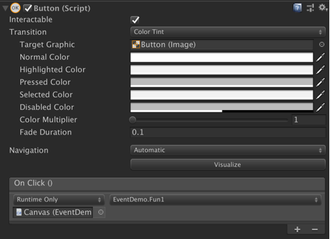
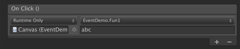
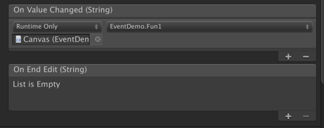
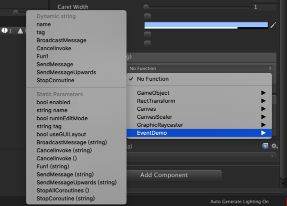

# UnityLearn-UGUI


## Unity 界面发展史

- OnGUI
- NGUI
- UGUI


## 基础控件

- Canvas 画布
- Rect Transform
- Image
- Text
- Button 按钮
- Toggle 复选框
- Slider 滑动条
- Scrollbar 滑动条
- Dropdown 下拉菜单
- InputField 输入框
- Panel 


## 分辨率调整

### 方法1：Game 窗口中添加

- Fixed Resolution
- Aspect Ration：比例

### 方法2：修改 Canvas - Inspector - Canvas Scaler(Script)

- Canvas Scaler(Script)

  - Scale With Screen Size

- Reference Match Mode：改为 Fixed Resolution

- Match：选择 Reference Match Mode 的较小边

  

## Component 组件

### Grid Layout Group (Script)

- Layout - Grid Layout Group 表格布局
- 自动排列，控制子元素的大小和位置，子元素不能更改。


## 事件注册

注意 EventSystem 是否可用，Scene 中 EventSystem 是共用的。

共 4 种方法：

### 方法1：通过编辑器方法

优点：方便、所见即所得

缺点：在代码中看不到是谁调用了这个方法，工作中（尤其团队开发）用得最少

```c#
using System.Collections;
using System.Collections.Generic;
using UnityEngine;
using UnityEngine.UI;

public class EventDemo : MonoBehaviour
{
    // 事件注册的 4 种方法：
    // 1. 通过编辑器方法

    public void Fun1(string input){
       
       print("Fun1: " + input);
   }
}
```

**Button**

1. 将脚本（EventDemo）挂到 GameObject 上（例如 Canvas 上）
2. 在 Button GameObject 的 Inspector 中：Button(Script) - On Click，点击 +，将挂有脚本的 GameObject（例如 Canvas）拖入相应框框里，选择脚本组件（EventDemo）中要调用的方法（Fun1）



可以为函数传入一个参数：在 Button(Script) - On Click 相应框框中输入参数即可，如下图：

当参数为数组时不可以。



**InputField**

两种事件：

- On Value Changed (String)：当值改变时触发。

- On End Edit (String)：当输入完成时触发：按下回车键或点击除此 InputField 外的其他地方。

参数可以选择：

- Dynamic string：传入的值即是在 InputField 中输入的值，是动态的，不能自己输入。

- Static Parameters：和 Button 一样，在相应的框框中输入。





**其他 Canvas 元素**

### 方法2：AddListener

优点：在代码中能看到是谁调用了这个方法

```c#
using System.Collections;
using System.Collections.Generic;
using UnityEngine;
using UnityEngine.UI;

public class EventDemo2 : MonoBehaviour
{
    // 事件注册的 4 种方法
    // 2. AddListener
    
    public void Fun2(){
    
        print("Fun2");
    }

    public void Fun3(string str){
    
        print("Fun3: " + str);
    }

    private void Start(){
        
        Button btn = this.transform.Find("AddListener/Button").GetComponent<Button>();
        // public delegate void UnityAction();
        // 需要传入一个 无返回值、无参数列表的方法
        btn.onClick.AddListener(Fun2);

        InputField input = this.transform.Find("AddListener/InputField").GetComponent<InputField>();
        // public delegatevoid UnityAction<T0>(T0 arg0);
        // 需要传入一个 无返回值，1个参数，参数类型为泛型，在这里是 string 的方法
        // input.onValueChange.AddListener(Fun3);
        input.onEndEdit.AddListener(Fun3);
    }
}
```

### 方法3：实现接口

所有的 UI、GameObject 都可以使用

依赖于：

EventSystem 上的 Event System (Script) ：负责分发。

和 Stamdalone Input Module  (Script) ：负责检测鼠标键盘（输入模块）。移动端应将其用 Touch Input Module (Script) 替换。如果是 VR 游戏，则需要重写Stamdalone Input Module 或者使用 VR TK。

以及 Canvas 上的 Graphic Raycaster (Script)：负责检测 Image 和 Text，Image 和 Text 接受事件。对于 Button 等 UI 元素来说也是 Button 上的 Image 和 Text 检测的，若将 Button 上的 Image (Script) Component 中的 Ray Target 和 Button 子 UI 元素 Text 上的 Text (Script) Component 中的 Ray Target 都禁用，Button 无法检测到被按下，事件也不会被触发。

- **鼠标指针类**（PC、移动端）
  - IPointerEnterHandler：移入
  - IPointerExitHandler：移出
  - IPointerDownHandler：按下
  - IPointerUpHandler：抬起
  - PointerClickHandler：按下后抬起
- **拖拽类**
  - IBeginDragHandler：开始拽
  - IDragHandler：正在拽
  - IEndDragHandler：结束拽
  - IDropHandler：释放
- **点选类**（InputField 有，Button 没有）
  - IUpdateSelectedHandler：点了选中后每帧执行
  - ISelectHandler：点了选中后那一帧执行
  - IDeselectHandler：不选了那一帧
- **输入类**（建立在选中的基础上）
  - IScrollHandler：选中 UI 后，滑动鼠标滚轮
  - IMoveHandler：选中 UI 后，移动（按键盘上的上下左右、wasd）
  - ISubmitHandler：选中 UI 后，按回车键
  - ICancelHandler：选中 UI 后，按 Esc 键

不能挂在 Canvas 上，实现接口的脚本需要挂在有 Raycast Target 的物体上：如 Image、Text、Button 等。

#### 实现：双击、拖拽 UI 元素（使之随光标移动）

### 方法4：自定义框架

